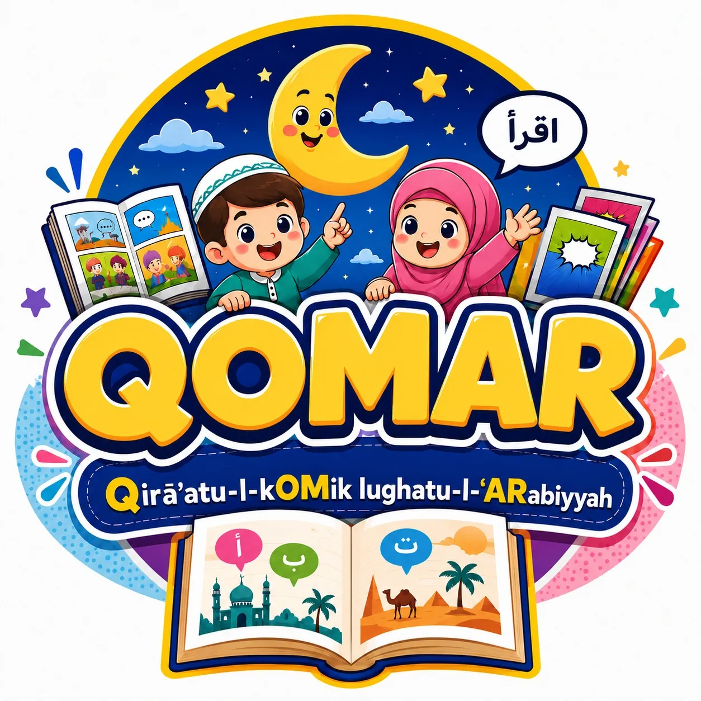

# BUKU PANDUAN PENGGUNAAN (MANUAL BOOK)
## Platform Pembelajaran Bahasa Arab Berbasis Komik Digital "QOMAR"
### Untuk Kelas IV Madrasah Ibtidaiyah (MI)



---

## 📖 KATA PENGANTAR

Selamat datang di **QOMAR (*Qira'atu-l-Komik Lughatul Arabiyah*)**! 

QOMAR adalah media pembelajaran Bahasa Arab interaktif berbasis komik digital yang dirancang khusus untuk siswa Kelas IV Madrasah Ibtidaiyah (MI). Platform ini menggabungkan alur cerita komik yang menarik, ilustrasi visual yang cerah, audio pelafalan asli, video pembelajaran, kuis interaktif, serta fitur aksesibilitas **Universal Design for Learning (UDL)** agar dapat digunakan dengan nyaman oleh seluruh siswa, termasuk siswa dengan kesulitan membaca (disleksia).

Buku panduan ini disusun untuk memberikan petunjuk langkah demi langkah bagi **Siswa** dan **Guru** dalam mengoperasikan seluruh fitur di dalam platform QOMAR.

---

## 💻 PERSYARATAN SISTEM (SYSTEM REQUIREMENTS)

Platform QOMAR dapat diakses secara langsung melalui penjelajah web (*web browser*) pada berbagai perangkat tanpa memerlukan instalasi aplikasi tambahan:

- **Perangkat yang Didukung**: Smartphone (Android / iOS), Tablet, iPad, Laptop, dan Komputer Desktop.
- **Browser yang Direkomendasikan**: Google Chrome, Mozilla Firefox, Safari, Microsoft Edge, atau Samsung Internet (versi terbaru).
- **Koneksi Internet**: Diperlukan untuk pertama kali memuat media, setelah itu halaman akan memuat dengan sangat cepat.
- **Perangkat Audio**: Speaker HP/Laptop atau Headphone/Earphone untuk mendengarkan audio pelafalan dan video.

---

## 🛠️ PANDUAN FITUR AKSESIBILITAS UDL (UNIVERSAL DESIGN FOR LEARNING)

QOMAR dilengkapi Toolbar Aksesibilitas di bagian atas header setiap halaman materi untuk memastikan kenyamanan membaca setiap siswa:

```
[ A- ]  [ A+ ]   [ 👁️ Mode Disleksia ]
```

1. **Pengatur Ukuran Teks (Zoom Font)**:
   - Tekan tombol **`A+`** untuk memperbesar ukuran tulisan (hingga 160%).
   - Tekan tombol **`A-`** untuk memperkecil ukuran tulisan (hingga 100%).
2. **Mode Font Disleksia**:
   - Klik tombol **Mode Disleksia** untuk mengaktifkan font khusus (OpenDyslexic) dengan jarak antarkata yang lebih renggang agar teks Latin lebih mudah dibaca oleh siswa disleksia.
   - *Catatan*: Teks Arab akan tetap menggunakan font *Amiri* agar harakat tetap jelas dan presisi.
3. **Penyimpanan Otomatis (Persistence)**:
   - Ukuran font dan mode disleksia yang Anda pilih akan disimpan secara otomatis di perangkat Anda. Anda tidak perlu mengaturnya ulang saat berpindah halaman!

---

## 👦 PANDUAN PENGGUNAAN UNTUK SISWA

### 1. Halaman Pembuka (Welcome Splash Screen)
- Buka link web QOMAR (misal: `index.html` atau URL publik).
- Anda akan disambut oleh halaman pembuka berdesain elegan dengan motto *"اَلْقِرَاءَةُ مِفْتَاحُ الْعِلْمِ"* (Membaca adalah kunci ilmu).
- Klik tombol **"Mulai Belajar"** untuk masuk ke Dashboard Pembelajaran.


---

### 2. Dashboard Pembelajaran (Hub Utama)
Dashboard adalah pusat navigasi utama. Dari sini, siswa dapat memilih 3 modul belajar:

1. 📚 **Modul Kosa Kata**: Belajar kata-kata Bahasa Arab baru lengkap dengan audio & gambar.
2. 🎬 **Modul Video**: Menonton cerita komik animasi Bahasa Arab.
3. 📝 **Modul Kuis**: Menguji pemahaman melalui latihan soal interaktif & tugas praktik.

---

### 3. Modul 1: Flashcard Kosa Kata (`kosa_kata.html`)
Di modul ini, siswa belajar kosakata Bahasa Arab per bab sebelum membaca komik:

- **Melihat Kartu Kata**: Kartu menampilkan teks Arab berharakat, cara membaca (transliterasi Latin), arti Bahasa Indonesia, dan gambar penjelas.
- **Mendengarkan Audio**: Klik tombol 🔊 **Putar Audio** untuk mendengarkan pelafalan kata yang benar.
- **Berpindah Kartu**: 
  - Tekan tombol **"Berikutnya"** atau **"Sebelumnya"**.
  - Pada layar sentuh HP/Tablet, siswa dapat **menggeser (*swipe*)** kartu ke kiri atau kanan.
  - Pada keyboard Komputer, tekan panah kanan `➡️` atau panah kiri `⬅️`.
- **Progress Bar**: Garis hijau di bawah kartu menunjukkan sejauh mana kosakata yang telah dipelajari.
- **Pindah ke Modul Video**: Di kartu terakhir, tombol navigasi akan berubah menjadi **"Tonton Video 🎬"**. Klik tombol tersebut untuk lanjut ke modul berikutnya.

---

### 4. Modul 2: Pemutar Video Komik (`video.html`)
Modul ini menyajikan visualisasi cerita komik dalam bentuk video:

- **Memutar Video**: Klik tombol **Play** pada pemutar video layar lebar (16:9).
- **Memilih Bab / Playlist**: Di samping/bawah pemutar video, terdapat daftar putar (*playlist*). Klik pada bab yang ingin ditonton:
  - **Bab 1**: *الْعُنْوَانُ* (Alamat)
  - **Bab 2**: *مِهْنَةُ أُسْرَةِ نَجِيْبَةِ* (Profesi Keluarga Najibah)
  - **Bab 3**: *الْأَمَلُ فِيْ الْمُسْتَقْبَلِ* (Cita-cita Masa Depan)
- **Membaca Deskripsi**: Di bawah pemutar video terdapat ringkasan penjelasan isi cerita.
- **Lanjut ke Kuis**: Setelah selesai menonton, klik tombol **"Mulai Kuis 📝"** di bagian bawah halaman.

---

### 5. Modul 3: Kuis Interaktif 3-Tab (`Kuis.html`)
Modul evaluasi terbagi dalam 3 Tab utama:

#### 📌 Tab 1: Pilihan Ganda (PG)
- Bacalah soal dan teks konteks dengan cermat.
- Klik salah satu pilihan jawaban (A, B, C, atau D).
- **Warna Indikator**:
  - Tombol akan berubah warna **Merah** jika jawaban salah.
  - Tombol akan berubah warna **Hijau** jika jawaban benar.
- Setelah menjawab semua soal, **Modal Popup Warna Emas** akan muncul secara otomatis menampilkan **Skor Akhir** Anda!

#### 📌 Tab 2: Soal Essay
- Jawablah pertanyaan pemahaman dengan mengetikkan jawaban pada kolom yang disediakan.
- Klik tombol **"Buka Kunci Jawaban"** di bawah soal untuk mencocokkan jawaban Anda dengan kunci jawaban resmi.

#### 📌 Tab 3: Tugas Praktik (Kirim WA)
- Bacalah petunjuk tugas praktik membaca komik dengan suara lantang.
- Rekam video Anda membaca komik menggunakan HP.
- Klik tombol hijau **"Kirim Video ke WhatsApp Guru"**.
- Aplikasi WhatsApp di HP/Komputer akan otomatis terbuka dengan draf pesan tugas yang siap dikirimkan ke Guru.

---

## 👩‍🏫 PANDUAN PENGGUNAAN UNTUK GURU

1. **Penggunaan di Kelas (Media Pembelajaran Utama)**:
   - Guru dapat menampilkan media QOMAR melalui Proyektor / Smart TV di depan kelas.
   - Gunakan **Modul Kosa Kata** untuk kegiatan menirukan pelafalan bersama-sama (*Istima' & Nathaq*).
   - Gunakan **Modul Video** untuk kegiatan menyimak cerita (*Mahārah Istimā'*).
2. **Evaluasi Pembelajaran Mandiri**:
   - Minta siswa mengerjakan **Kuis Pilihan Ganda** di akhir pertemuan untuk melihat tingkat pemahaman secara langsung.
   - Manfaatkan **Kuis Essay** untuk diskusi kelompok di kelas.
3. **Penerimaan Tugas Praktik via WhatsApp**:
   - Pastikan nomor WhatsApp Guru sudah terdaftar di sistem (pada berkas `js/data.js`).
   - Siswa akan mengirimkan rekaman membaca langsung ke nomor WhatsApp Guru secara personal. Guru dapat memberikan umpan balik (*feedback*) atau nilai secara langsung via chat.

---

## ❓ PERTANYAAN FREKUEN & PENANGANAN MASALAH (FAQ & TROUBLESHOOTING)

Q: **Mengapa suara audio pelafalan tidak terdengar?**
A: Pastikan volume HP/Komputer Anda tidak di-mute. Di HP Android/iPhone, pastikan HP tidak dalam mode hening (*Silent Mode*).

Q: **Apakah aplikasi ini harus didownload di Play Store / App Store?**
A: Tidak perlu! QOMAR adalah web app berbasis browser. Cukup simpan/bookmark link web di browser HP siswa.

Q: **Bagaimana jika teks terasa terlalu kecil di HP siswa?**
A: Tekan tombol **`A+`** di bagian atas header halaman sampai ukuran teks terasa nyaman dibaca.

Q: **Bagaimana cara mengubah nomor WhatsApp Guru penerima tugas?**
A: Buka file `js/data.js` menggunakan editor teks (Notepad/VS Code), cari bagian `nomorWA`, ubah nomor telepon (gunakan format awalan `62`, contoh: `6285707602967`), lalu simpan berkas.

---

## 📩 KONTAK & DUKUNGAN

Jika terdapat kendala teknis atau pertanyaan lebih lanjut terkait penggunaan platform QOMAR:
- **Pengembang Proyek**: Tim Developer Web QOMAR (Atnan, Narendra, Rifki)
- **Email / Kontak**: Support Team QOMAR
- **Hak Cipta**: &copy; 2026 QOMAR — Platform Pembelajaran Bahasa Arab Berbasis Komik Digital & UDL. All Rights Reserved.
