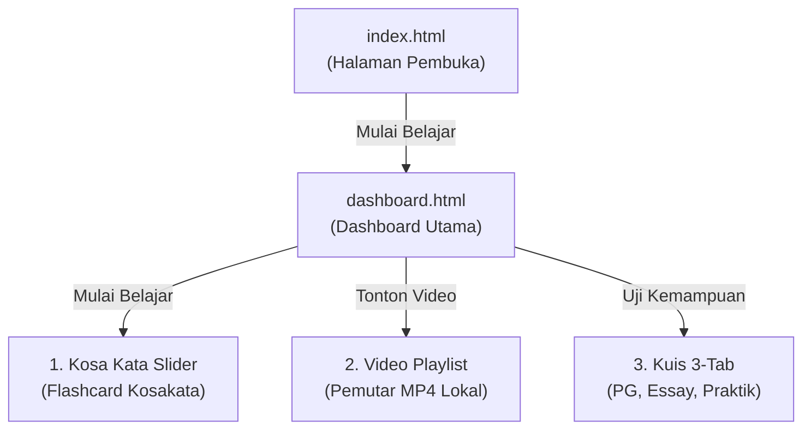
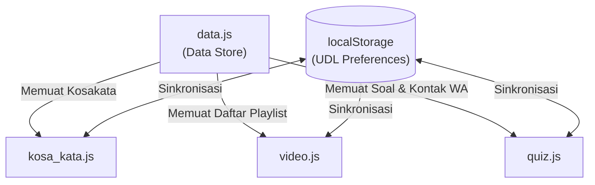

# Panduan Pengembangan (Developer Guide) - E-Book QOMAR

Panduan ini dirancang untuk memberikan pemahaman menyeluruh tentang arsitektur, standar desain, dan alur pengerjaan bagi tim pengembang (**Atnan**, **Narendra**, dan **Rifki**) dalam menyelesaikan platform pembelajaran Bahasa Arab berbasis komik digital **QOMAR**.

---

## 1. Pemahaman Proyek QOMAR

**QOMAR (*Qira'atu-l-Komik Lughatul Arabiyah*)** adalah platform pembelajaran Bahasa Arab interaktif berbasis web untuk siswa Kelas IV Madrasah Ibtidaiyah (MI). Tujuan utamanya adalah meningkatkan keterampilan membaca (*Mahārah Qirā'ah*) siswa secara menyenangkan.

### Alur Belajar Siswa


---

## 2. Arsitektur Teknis & Standar Desain

Agar aplikasi memiliki kualitas premium dan konsisten, seluruh pengembang wajib mengikuti standar berikut:

### A. Centralized Data Store (Penyimpanan Data Terpusat)
Semua konten dinamis (kata, video, soal kuis) dimuat dari berkas [data.js](file:///d:/Projek-web/Ebook/Qomar/js/data.js). Modul JavaScript masing-masing halaman tidak boleh menulis data secara hardcoded.



### B. Universal Design for Learning (UDL) & Aksesibilitas
Platform wajib ramah disabilitas (kesulitan membaca/disleksia) melalui Toolbar Aksesibilitas di bagian Header:
- **Teks Zoom**: Tombol `A-` dan `A+` untuk mengubah skala font antara **100% hingga 160%** (interval 10%). Terapkan dengan menambahkan kelas `.font-scale-100` s.d `.font-scale-160` pada elemen `<html>`.
- **Mode Disleksia**: Tombol toggle untuk mengaktifkan font khusus pembaca disleksia (mengubah font-family seluruh body menjadi OpenDyslexic atau Comic Sans). Terapkan dengan kelas `.dyslexia-mode` pada `<body>`.
- **Persistence (Penyimpanan)**: Preferensi zoom dan disleksia wajib disimpan di `localStorage` agar pilihan pengguna tetap aktif saat berpindah-pindah halaman.
- > [!IMPORTANT]
  > Sesuai instruksi pengguna, **Fitur Text-to-Speech (TTS) ditiadakan** (tidak perlu ada ikon speaker/suara pelafalan teks).

### C. Visual Aesthetics (Desain Premium)
- **Glassmorphism**: Gunakan kartu semi-transparan dengan properti `backdrop-filter: blur(20px)` dan border tipis kebiruan (`rgba(2, 38, 128, 0.15)`) di atas latar belakang bermotif halus (`.bg-pattern`).
- **Typography**: Gunakan jenis font sans-serif modern (misal: Inter atau Outfit) untuk teks Latin, dan Google Font **Amiri** dengan ukuran besar untuk teks Bahasa Arab.
- **Mobile-First Sticky Footer Navigation**:
  - Tombol navigasi bawah ("Sebelumnya", "Berikutnya") wajib diposisikan `position: fixed` di dasar layar.
  - Untuk menjaga kerapian, bar navigasi membentang penuh 100%, tetapi konten tombol dibatasi oleh pembungkus (`.nav-control-inner` atau `.quiz-nav-inner`) dengan **`max-width: 560px`** agar sejajar tegak lurus dengan batas sisi kartu konten di atasnya.

---

## 3. Detail Tugas Pengembang

Setiap pengembang memiliki tanggung jawab spesifik yang terisolasi namun saling terhubung melalui berkas database bersama.

### 👤 Atnan: Modul Kosa Kata, Halaman Utama & Centralized Data Store

Atnan bertanggung jawab membuat basis data bersama, halaman pembuka (welcome screen), dashboard pembelajaran, serta halaman flashcard kosakata.

| File | Peran | Instruksi Pekerjaan |
| :--- | :--- | :--- |
| [data.js](file:///d:/Projek-web/Ebook/Qomar/js/data.js) | **Basis Data** | Buat array `kosaKataMateri`, `videoMateri`, `kuisPG`, `kuisEssay`, dan `praktikInfo` dengan data relasional lengkap. |
| [index.html](file:///d:/Projek-web/Ebook/Qomar/index.html) | **Halaman Pembuka** | Buat halaman pembuka minimalis yang memukau berisi judul, logo persegi rounded, kutipan bahasa Arab, tombol CTA ke dashboard, dan sinkronisasi preferensi UDL. |
| [dashboard.html](file:///d:/Projek-web/Ebook/Qomar/Public/Page/dashboard.html) | **Dashboard Pembelajaran** | Buat hub menu materi (Kosa Kata, Video, Kuis), visualisasi sinopsis, informasi kontak, dan sinkronisasi preferensi UDL. |
| [kosa_kata.html](file:///d:/Projek-web/Ebook/Qomar/Public/Page/kosa_kata.html) | **Kerangka Struktur** | Buat halaman slider kosakata, toolbar UDL di header, bar progres belajar di bawah header, dan pembungkus navigasi bawah. |
| [kosa_kata.js](file:///d:/Projek-web/Ebook/Qomar/js/kosa_kata.js) | **Logika Slider** | Hubungkan data kosa kata secara dinamis. Buat transisi slide kiri/kanan saat navigasi, aktifkan deteksi geser layar (swipe) dan panah keyboard, serta logikakan penyimpanan UDL ke `localStorage`. |
| [kosa_kata.css](file:///d:/Projek-web/Ebook/Qomar/css/kosa_kata.css) | **Gaya Visual** | Desain slider card glassmorphism yang responsif, visual progres bar, dan bar navigasi bawah yang lurus presisi. |

---

### 👤 Narendra: Modul Pemutar & Daftar Putar Video

Narendra bertanggung jawab atas modul playlist dan pemutaran video edukasi lokal.

| File | Peran | Instruksi Pekerjaan |
| :--- | :--- | :--- |
| [video.html](file:///d:/Projek-web/Ebook/Qomar/Public/Page/video.html) | **Kerangka Struktur** | Susun area pemutar video utama menggunakan tag `<video>` lokal, card deskripsi video di bawah pemutar, panel playlist di samping/bawah, serta tombol navigasi menuju kuis. |
| [video.js](file:///d:/Projek-web/Ebook/Qomar/js/video.js) | **Logika Pemutar** | Ambil list dari `videoMateri`. Saat playlist diklik, ganti atribut `.src` pada elemen video ke path lokal (.mp4) dan jalankan fungsi `.load()` untuk menyegarkan video. Sinkronkan status aktif list item. |
| [video.css](file:///d:/Projek-web/Ebook/Qomar/css/video.css) | **Gaya Visual** | Atur aspek rasio wadah video agar konsisten 16:9 widescreen, desain style aktif pada item playlist, dan buat transisi responsif agar playlist bergeser ke bawah pemutar di layar mobile. |

---

### 👤 Rifki: Modul Kuis Interaktif (3-Tab Kuis)

Rifki bertanggung jawab atas pembuatan evaluasi interaktif siswa yang terbagi atas tiga metode pengujian.

| File | Peran | Instruksi Pekerjaan |
| :--- | :--- | :--- |
| [Kuis.html](file:///d:/Projek-web/Ebook/Qomar/Public/Page/Kuis.html) | **Kerangka Struktur** | Buat navigasi tab switcher (PG, Essay, Praktik). Siapkan area nomor soal PG, wadah soal, popup overlay hasil kuis, daftar soal essay dengan textarea, serta panduan rekam video praktik. |
| [quiz.js](file:///d:/Projek-web/Ebook/Qomar/js/quiz.js) | **Logika Interaktif** | Logikakan perpindahan tab panel tanpa refresh. Hitung skor PG, kunci pilihan pasca submit, beri indikasi nomor kuis benar/salah, tampilkan kunci jawaban essay saat tombol reveal diklik, serta arahkan teks dan link tugas praktik ke API WhatsApp Guru. |
| [kuis.css](file:///d:/Projek-web/Ebook/Qomar/css/kuis.css) | **Gaya Visual** | Desain tombol tab aktif, warna border pilihan ganda (benar = hijau, salah = merah), popup modal hasil kuis berbingkai emas, textarea essay, dan tombol kirim WhatsApp hijau terang. |

---

## 4. Alur Integrasi Bersama

Untuk menyatukan pekerjaan kalian dengan mulus, ikuti langkah-langkah penggabungan berikut:

1. **Atnan** membuat basis data di `data.js` terlebih dahulu agar **Narendra** dan **Rifki** memiliki data untuk dirender.
2. Saat mengimplementasikan JavaScript (`kosa_kata.js`, `video.js`, `quiz.js`), masing-masing pengembang wajib menyertakan modul pembacaan preferensi UDL berikut pada event `DOMContentLoaded`:
   ```javascript
   function loadPreferences() {
       const scale = localStorage.getItem('fontScale') || '100';
       const dyslexia = localStorage.getItem('dyslexiaMode') === 'true';
       
       // Terapkan skala zoom font ke HTML tag
       document.documentElement.className = `font-scale-${scale}`;
       
       // Terapkan mode disleksia ke body tag
       if (dyslexia) {
           document.body.classList.add('dyslexia-mode');
       } else {
           document.body.classList.remove('dyslexia-mode');
       }
   }
   ```
3. Lakukan pengetesan bersama: Buka halaman Kosa Kata, ubah ukuran teks menjadi 130% dan aktifkan Mode Disleksia. Beralihlah ke halaman Video dan Kuis; pastikan ukuran teks dan jenis font tetap konsisten (tidak kembali ke awal).
4. Pastikan semua elemen interaktif (tombol, input, opsi) memiliki atribut ID yang unik untuk mempermudah browser testing.
