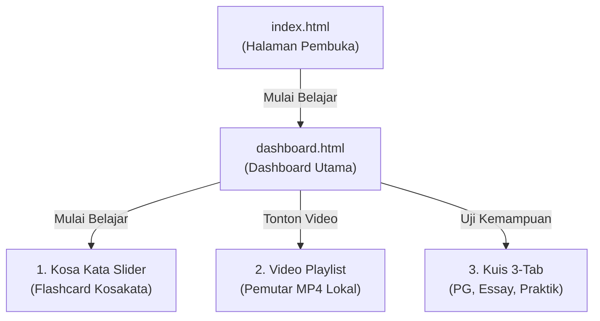
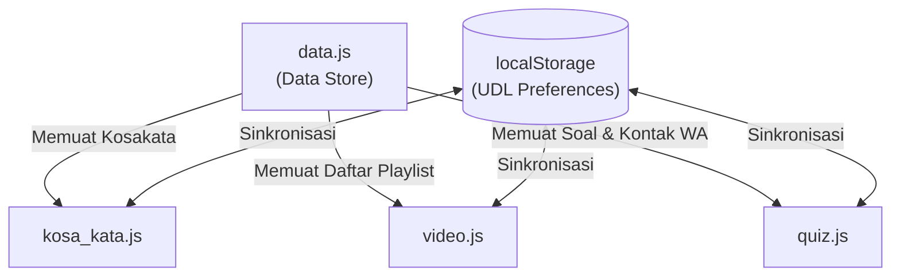

# Spesifikasi Kebutuhan Perangkat Lunak (Software Requirements Specification - SRS)
## Proyek: E-Book Komik Digital QOMAR

Dokumen Spesifikasi Kebutuhan Perangkat Lunak (SKPL) atau *Software Requirements Specification (SRS)* ini disusun untuk mendefinisikan seluruh kebutuhan fungsional dan non-fungsional dari platform pembelajaran Bahasa Arab berbasis komik digital **QOMAR** (*Qira'atu-l-Komik Lughatul Arabiyah*). Dokumen ini menjadi acuan utama bagi tim pengembang (**Atnan**, **Narendra**, dan **Rifki**) serta klien selama proses pengembangan, pengujian, dan serah terima sistem.

---

## 1. PENDAHULUAN

### 1.1 Tujuan Dokumen
Tujuan dari dokumen SRS ini adalah:
1. Merinci kebutuhan sistem, baik dari sisi antarmuka, fungsionalitas, maupun kualitas non-fungsional platform QOMAR.
2. Menyediakan kesepakatan tertulis antara tim pengembang dan klien (guru/sekolah) mengenai cakupan fitur yang akan dibangun.
3. Menjadi panduan kerja terstruktur bagi tim pengembang untuk meminimalkan risiko ketidaksesuaian implementasi.

### 1.2 Ruang Lingkup Produk
**QOMAR** adalah sebuah e-book interaktif berbasis web statis (HTML, CSS, JS) yang dirancang untuk mendukung pembelajaran Bahasa Arab bagi siswa Kelas IV Madrasah Ibtidaiyah (MI), khususnya pada aspek keterampilan membaca (*Mahārah Qirā'ah*). 
- **Cakupan Produk**: Platform ini menyediakan modul pembelajaran berupa *flashcard* kosakata, pemutaran cerita komik berbasis video lokal, serta evaluasi interaktif berbentuk kuis 3-tab (Pilihan Ganda, Essay, dan Praktik). Sistem juga dilengkapi dengan toolbar aksesibilitas berbasis prinsip *Universal Design for Learning* (UDL) untuk membantu siswa dengan kesulitan membaca/disleksia.
- **Di Luar Cakupan**: Sistem tidak menggunakan database server (backend). Seluruh data disimpan secara statis di sisi klien (*client-side*) melalui penyimpanan lokal (*localStorage*) dan file data terpusat (`data.js`). Fitur *Text-to-Speech* (TTS) atau audio pelafalan otomatis ditiadakan berdasarkan kesepakatan dengan klien.

### 1.3 Definisi, Akronim, dan Singkatan
- **SRS**: *Software Requirements Specification* (Spesifikasi Kebutuhan Perangkat Lunak).
- **UDL**: *Universal Design for Learning*, pendekatan desain instruksional yang fleksibel dan dapat diakses oleh beragam kebutuhan belajar pengguna.
- **TTS**: *Text-to-Speech*, teknologi pengubah teks tertulis menjadi suara digital.
- **PG**: Pilihan Ganda.
- **API**: *Application Programming Interface*.
- **MI**: Madrasah Ibtidaiyah.

### 1.4 Referensi
1. *Product Requirement Document (PRD) - Spesifikasi Klien* (Documentation/1_Spesifikasi_Klien_PRD.md).
2. *Technical & Architecture Specification - Panduan Pengembang* (Documentation/2_Spesifikasi_Teknis_Arsitektur.md).
3. *Project Roadmap & Work Breakdown Structure (WBS)* (Documentation/3_Roadmap_WBS.md).
4. *Rencana Pengujian: Quality Assurance (QA) & User Acceptance Testing (UAT)* (Documentation/4_Rencana_Pengujian_QA_UAT.md).

---

## 2. DESKRIPSI UMUM PERANGKAT LUNAK

### 2.1 Perspektif Produk
Platform QOMAR merupakan sistem mandiri berbasis web statis yang berjalan langsung pada peramban (*web browser*) klien tanpa memerlukan server database aktif. Struktur navigasi dan ketergantungan antar-halaman didefinisikan dalam diagram alir berikut:


```mermaid
graph TD
    Welcome["index.html<br>(Halaman Pembuka)"] -->|Mulai Belajar| Dashboard["dashboard.html<br>(Dashboard Utama)"]
    Dashboard -->|Mulai Belajar| KK["1. Kosa Kata Slider<br>(Flashcard Kosakata)"]
    Dashboard -->|Tonton Video| V["2. Video Playlist<br>(Pemutar MP4 Lokal)"]
    Dashboard -->|Uji Kemampuan| K["3. Kuis 3-Tab<br>(PG, Essay, Praktik)"]
```

### 2.2 Fungsi Produk
Platform ini memiliki fungsi utama sebagai berikut:
1. **Penyambung Pembelajaran (Welcome Screen)**: Menyambut siswa dengan visualisasi estetik dan mengarahkan mereka ke menu utama.
2. **Navigasi Terstruktur (Dashboard)**: Menyediakan hub utama informasi materi, deskripsi singkat aplikasi, dan kontak guru.
3. **Pengenalan Kosakata (Kosa Kata)**: Menampilkan kartu kosakata interaktif dengan visualisasi gambar, teks Arab (berharakat), transliterasi latin, dan arti.
4. **Visualisasi Cerita (Video Playlist)**: Memutar video animasi cerita komik lokal berukuran aspek rasio 16:9 dengan kendali daftar putar yang mudah dipahami anak-anak.
5. **Evaluasi Interaktif (3-Tab Quiz)**: Menguji pemahaman siswa secara instan lewat latihan pilihan ganda, mencocokkan kunci jawaban essay secara mandiri, dan penyerahan tugas rekam suara/video ke guru via WhatsApp.
6. **Aksesibilitas Khusus (UDL Toolbar)**: Membantu siswa dengan keterbatasan visual ringan atau disleksia menggunakan pengatur font zoom dan mode font disleksia.

### 2.3 Karakteristik Pengguna
Pengguna utama platform ini terbagi menjadi dua kategori:
1. **Siswa Kelas IV Madrasah Ibtidaiyah (MI)**:
   - Rentang usia 9–10 tahun.
   - Memerlukan visual yang menarik (warna cerah, animasi halus, ilustrasi komik).
   - Membutuhkan navigasi yang sederhana dan berukuran tombol yang cukup besar untuk kemudahan interaksi sentuh.
2. **Guru Bahasa Arab MI**:
   - Berperan sebagai pengampu mata pelajaran dan penilai.
   - Menerima hasil tugas praktik siswa secara langsung di aplikasi pesan WhatsApp.

### 2.4 Batasan-Batasan
- **Platform**: Berjalan pada peramban web modern (Google Chrome, Microsoft Edge, Safari, Firefox) baik di desktop, tablet, maupun ponsel pintar (responsive web).
- **Penyimpanan**: Terbatas pada *localStorage* klien dengan kapasitas maksimal ~5MB untuk menyimpan preferensi aksesibilitas.
- **Konten Lokal**: File video harus dimuat secara lokal dari folder `/Public/Video/` guna meminimalkan kegagalan pemuatan akibat koneksi internet yang lambat di sekolah.
- **Tanpa Fitur Audio Otomatis (TTS)**: Pelafalan teks Arab tidak didukung oleh suara komputer digital. Pembelajaran bergantung pada teks transliterasi latin yang jelas dan video panduan guru.

### 2.5 Asumsi dan Ketergantungan
- Sistem diasumsikan berjalan secara offline/lokal setelah seluruh aset (termasuk video lokal) diunduh ke perangkat peramban, kecuali fitur pengiriman kuis via WhatsApp yang membutuhkan koneksi internet aktif untuk mengarahkan pengguna ke web WhatsApp.
- Font khusus *OpenDyslexic* diasumsikan terinstal/dimuat dengan benar melalui folder lokal `/Public/fonts/` agar fitur UDL berjalan lancar meskipun perangkat tidak tersambung ke layanan Google Fonts.

---

## 3. KEBUTUHAN ANTARMUKA EKSTERNAL

### 3.1 Antarmuka Pengguna (User Interface)
Desain visual platform QOMAR wajib menerapkan standar estetika premium dan inklusif:
1. **Efek Glassmorphism**: Seluruh kontainer kartu konten harus menggunakan kelas `.glass-card` atau `.glass-card-strong` dengan spesifikasi:
   - Latar belakang semi-transparan: `rgba(255, 255, 255, 0.88)`
   - Filter blur: `backdrop-filter: blur(30px)`
   - Border halus kebiruan: `rgba(2, 38, 128, 0.25)`
2. **Palet Warna Sistem**:
   - **Biru Tua (Deep Blue)**: `#022680` (Warna utama/kepercayaan).
   - **Pink Cerah (Pink Accent)**: `#E2528C` (Aksen tombol interaktif & penanda aktif).
   - **Hijau Toska (Teal)**: `#139C80` (Tombol penyelesaian/sukses).
   - **Kuning Emas (Gold)**: `#FFCF27` (Aksen lencana hasil kuis & ornamen judul).
3. **Tipografi**:
   - Teks Latin menggunakan jenis huruf modern **Inter** atau **Segoe UI** dengan keterbacaan tinggi.
   - Teks Arab menggunakan font Google **Amiri** dengan ukuran minimal `1.5em` kali lebih besar dibanding teks latin sekitarnya guna memastikan tanda harakat terbaca dengan sangat jelas.
4. **Navigasi Mobile-First**:
   - Tombol navigasi bawah ("Sebelumnya", "Berikutnya") wajib berstatus `position: fixed` di dasar layar.
   - Lebar pembungkus tombol navigasi dibatasi maksimal **`max-width: 560px`** agar sejajar presisi secara vertikal dengan kartu konten utama di layar desktop.

### 3.2 Antarmuka Perangkat Keras (Hardware Interfaces)
Platform ini tidak berinteraksi langsung dengan perangkat keras khusus, tetapi membutuhkan:
- Layar tampilan dengan resolusi minimum `320px` (lebar layar ponsel cerdas terkecil).
- Perangkat masukan berupa layar sentuh (*touchscreen*), mouse, atau papan ketik (keyboard) untuk navigasi.

### 3.3 Antarmuka Perangkat Lunak (Software Interfaces)
- **Teknologi Core**: HTML5 untuk kerangka struktur, CSS3 untuk gaya visual dan animasi, serta Vanilla JavaScript (ES6+) untuk logika interaktif.
- **Penyimpanan**: API `window.localStorage` pada web browser.
- **Aset Font**: Font lokal `OpenDyslexic` (.otf/.woff) diletakkan di `/Public/fonts/` dan font `Amiri` dari Google Fonts CDN.

### 3.4 Antarmuka Komunikasi (Communication Interfaces)
- **Integrasi WhatsApp**: Menggunakan skema URI `https://api.whatsapp.com/send?phone=...&text=...` untuk mengirimkan konfirmasi tugas praktik siswa langsung ke nomor guru. Parameter `text` berupa pesan default yang ter-encode URL dengan aman (`encodeURIComponent`).

---

## 4. KEBUTUHAN FUNGSIONAL

### 4.1 Modul Halaman Pembuka (Welcome Splash Screen)
- **ID Kebutuhan**: `REQ-FN-01`
- **Deskripsi**: Menampilkan layar penyambut siswa saat pertama kali membuka platform di berkas `index.html`.
- **Fitur Detail**:
  1. Menampilkan logo QOMAR dengan bingkai persegi melengkung (*squircle*) beranimasi denyut halus.
  2. Menampilkan teks judul platform dan kutipan motto Bahasa Arab: *"اَلْقِرَاءَةُ مِفْتَاحُ الْعِلْمِ"*.
  3. Menyediakan tombol "Mulai Belajar" yang mengarahkan pengguna ke halaman `Public/Page/dashboard.html`.
  4. Memuat preferensi UDL dari `localStorage` saat inisialisasi agar gaya tampilan langsung menyesuaikan pengaturan sebelumnya.

### 4.2 Modul Dashboard Pembelajaran (Hub Utama)
- **ID Kebutuhan**: `REQ-FN-02`
- **Deskripsi**: Berfungsi sebagai menu navigasi utama siswa untuk mengakses materi di `Public/Page/dashboard.html`.
- **Fitur Detail**:
  1. Menyediakan 3 kartu navigasi besar yang terhubung langsung ke modul materi: **Kosa Kata** (`kosa_kata.html`), **Tonton Video** (`video.html`), dan **Uji Kemampuan** (`Kuis.html`).
  2. Menampilkan sinopsis singkat platform QOMAR dalam bentuk kartu glassmorphism.
  3. Menyediakan informasi kontak tim pengembang/guru di bagian bawah halaman.
  4. Menyediakan sinkronisasi preferensi aksesibilitas UDL.

### 4.3 Modul Kosa Kata (Flashcard Slider)
- **ID Kebutuhan**: `REQ-FN-03`
- **Deskripsi**: Menyajikan materi kartu kosakata Bahasa Arab yang interaktif di `Public/Page/kosa_kata.html` dan `js/kosa_kata.js`.
- **Fitur Detail**:
  1. Membaca data kosakata secara dinamis dari database terpusat `data.js`.
  2. Menampilkan kartu kata satu per satu dengan informasi: Teks Arab Amiri, Transliterasi Latin, Arti Bahasa Indonesia, dan Ilustrasi Gambar Pendukung.
  3. Mendukung navigasi slider menggunakan tombol "Sebelumnya" dan "Berikutnya" di bagian bawah layar.
  4. Mendukung navigasi pintasan melalui geser layar (*swipe gesture*) untuk layar sentuh dan tombol panah kiri/kanan pada keyboard desktop.
  5. Menampilkan bilah progres belajar (*Progress Bar*) yang menghitung persentase penyelesaian belajar kosakata berdasarkan indeks kartu aktif.
  6. Pada kartu terakhir, tombol "Berikutnya" secara dinamis berubah fungsi menjadi tombol **"Tonton Video"** yang mengarahkan siswa ke halaman pemutar video (`video.html`).

### 4.4 Modul Pemutar & Daftar Putar Video
- **ID Kebutuhan**: `REQ-FN-04`
- **Deskripsi**: Menyediakan daftar putar video animasi cerita komik di `Public/Page/video.html` dan `js/video.js`.
- **Fitur Detail**:
  1. Memuat playlist video secara dinamis dari `videoMateri` di `data.js`.
  2. Menyediakan pemutar video utama berbasis elemen `<video>` lokal dengan aspek rasio widescreen 16:9.
  3. Menampilkan daftar judul video di samping pemutar (pada desktop) atau di bawah pemutar (pada mobile).
  4. Memungkinkan pengguna mengganti video yang sedang diputar dengan mengeklik item pada daftar putar.
  5. Memperbarui judul dan deskripsi penjelasan video secara otomatis di bawah pemutar sesuai dengan video yang aktif.
  6. Menyediakan tombol navigasi sticky footer di dasar layar untuk melanjutkan ke modul kuis (`Kuis.html`).

### 4.5 Modul Kuis Interaktif (3-Tab Quiz)
- **ID Kebutuhan**: `REQ-FN-05`
- **Deskripsi**: Menyediakan 3 metode evaluasi belajar siswa dalam satu halaman di `Public/Page/Kuis.html` dan `js/quiz.js`.
- **Fitur Detail**:
  1. **Tab Switcher**: Menyediakan navigasi 3 tab (Pilihan Ganda, Essay, Praktik) untuk berpindah panel kuis tanpa memicu muat ulang halaman (*no-refresh page*).
  2. **Kuis Pilihan Ganda (PG)**:
     - Memuat soal PG dari `kuisPG` di `data.js`.
     - Menyediakan indikator nomor soal yang sedang aktif.
     - Mengubah warna latar opsi jawaban setelah dipilih: Hijau untuk jawaban benar, Merah untuk jawaban salah. Pilihan lain otomatis terkunci setelah satu opsi diklik.
     - Di akhir kuis (soal terakhir dijawab), sistem menampilkan pop-up modal overlay warna emas berisi skor akhir (skor = (jawaban benar / total soal) * 100) dan tombol tutup/ulangi kuis.
  3. **Kuis Essay**:
     - Memuat soal essay dari `kuisEssay` di `data.js`.
     - Menyediakan area pengisian jawaban teks (*textarea*).
     - Menyediakan tombol "Buka Kunci Jawaban" untuk menampilkan kunci jawaban resmi dari database di bawah kolom input jawaban sebagai sarana koreksi mandiri siswa.
  4. **Kuis Praktik**:
     - Membaca data instruksi dari `praktikInfo` di `data.js`.
     - Menyediakan tombol "Kirim ke WhatsApp Guru" yang mengintegrasikan data nomor WhatsApp guru dan teks pesan default tugas untuk dikirimkan melalui API WhatsApp.

### 4.6 Toolbar Aksesibilitas UDL
- **ID Kebutuhan**: `REQ-FN-06`
- **Deskripsi**: Menyediakan kontrol aksesibilitas terpusat pada header halaman materi (`kosa_kata.html`, `video.html`, dan `Kuis.html`).
- **Fitur Detail**:
  1. **Tombol Font Zoom (A+ & A-)**: Mengubah skala ukuran huruf seluruh dokumen antara 100% hingga 160% dengan kenaikan/penurunan interval 10%. Perubahan dilakukan dengan menambahkan kelas skala font (`.font-scale-100` s.d `.font-scale-160`) pada tag elemen `<html>`.
  2. **Toggle Mode Disleksia**: Mengaktifkan/menonaktifkan font khusus pembaca disleksia (*OpenDyslexic* atau alternatif *Comic Sans*) dengan menyematkan kelas `.dyslexia-mode` pada tag `<body>`.
  3. **Penyimpanan Lokal (Persistence)**: Menyimpan preferensi ukuran font dan status mode disleksia ke dalam `localStorage`. Saat halaman baru dimuat, sistem wajib memanggil preferensi tersebut dan menerapkannya secara instan.

---

## 5. KEBUTUHAN NON-FUNGSIONAL

### 5.1 Kinerja (Performance)
- **Kecepatan Muat**: Platform harus memuat halaman dalam waktu kurang dari 2 detik pada kondisi lokal.
- **Ukuran Aset**: Aset gambar harus dioptimalkan menggunakan format `.webp` dengan ukuran berkas di bawah 150KB per gambar untuk mencegah jeda render.

### 5.2 Keamanan (Security)
- **Integritas Data Klien**: Seluruh data yang disimpan bersifat lokal di perangkat siswa. Tidak ada pengiriman data sensitif ke server eksternal, kecuali pengalihan aman ke API WhatsApp resmi untuk pengiriman tugas.

### 5.3 Kompatibilitas & Responsivitas (Compatibility & Responsiveness)
- **Kompatibilitas Browser**: Wajib kompatibel dengan peramban Chrome (Android/Desktop), Safari (iOS/macOS), dan Edge (Windows).
- **Desain Responsif**: Tampilan harus menyesuaikan secara otomatis untuk lebar layar berikut:
  - Mobile (Layar Handphone): `320px` s.d `576px`
  - Tablet/iPad: `577px` s.d `992px`
  - Desktop/Laptop: `> 992px`

### 5.4 Usabilitas (Usability)
- **Keterbacaan**: Jarak antarbaris (*line-height*) pada mode disleksia minimal `1.8` dan jarak antarhuruf (*letter-spacing*) minimal `0.05em` untuk memudahkan siswa disleksia membaca materi latin.
- **Interaksi**: Ukuran tombol klik/sentuh minimal `44px x 44px` sesuai pedoman aksesibilitas seluler.

---

## 6. MODEL DATA DAN ARSITEKTUR TEKNIS

### 6.1 Skema Centralized Data Store (`data.js`)
Seluruh konten e-book disimpan di `js/data.js` dengan struktur contoh data berikut:

```javascript
// Database Statis QOMAR
const kosaKataMateri = [
  {
    id: 1,
    arab: "مَدْرَسَةٌ",
    transliterasi: "Madrasatun",
    arti: "Sekolah",
    gambar: "../Image/sekolah.webp"
  }
];

const videoMateri = [
  {
    id: 1,
    judul: "Perkenalan di Sekolah",
    deskripsi: "Tonton komik perkenalan Bahasa Arab di sekolah bersama Ahmad dan Fatimah.",
    videoUrl: "../Video/perkenalan.mp4"
  }
];

const kuisPG = [
  {
    id: 1,
    soal: "Apa arti dari kosakata 'مَدْرَسَةٌ'?",
    opsi: ["Masjid", "Rumah", "Sekolah"],
    correctIndex: 2
  }
];

const kuisEssay = [
  {
    id: 1,
    soal: "Sebutkan 3 kosakata yang berhubungan dengan kelas!",
    kunciJawaban: "Kunci: 1. مَكْتَبٌ (Meja), 2. كُرْسِيٌّ (Kursi), 3. سَبُّوْرَةٌ (Papan Tulis)."
  }
];

const praktikInfo = {
  nomorWA: "6285707602967",
  pesanDefault: "Assalamu'alaikum Wr. Wb. Pak/Bu Guru, berikut adalah rekaman tugas praktik membaca komik Bahasa Arab QOMAR saya.",
  instruksi: "Bacalah komik bab I dengan lantang. Rekam video berdurasi maksimal 2 menit, lalu kirim ke WhatsApp Guru."
};
```

### 6.2 Integrasi Arsitektur JavaScript Terpusat
Seluruh modul membaca dari `data.js` dan mensinkronisasikan pilihan aksesibilitas lewat penyimpanan lokal seperti terlihat pada diagram arsitektur teknis berikut:


```mermaid
graph TD
    data["data.js<br>(Data Store)"] -->|Memuat Kosakata| kk_js["kosa_kata.js"]
    data -->|Memuat Daftar Playlist| v_js["video.js"]
    data -->|Memuat Soal & Kontak WA| q_js["quiz.js"]
    
    local_storage[("localStorage<br>(UDL Preferences)")] <-->|Sinkronisasi| kk_js
    local_storage <-->|Sinkronisasi| v_js
    local_storage <-->|Sinkronisasi| q_js
```

---

## 7. STRUKTUR ORGANISASI TIM & WORK BREAKDOWN STRUCTURE (WBS)

Untuk menjamin kelancaran integrasi sistem, pengerjaan dibagi secara merata kepada 3 pengembang dengan pembagian modul sebagai berikut:

### 7.1 Pembagian Tugas Anggota Tim

| Pengembang | Peran & Modul Utama | Tanggung Jawab Berkas |
| :--- | :--- | :--- |
| 👤 **Atnan** | Pimpinan Tim, Database Terpusat, Splash Screen, Dashboard, & Modul Kosa Kata | `data.js`, `index.html`, `welcome.css`, `dashboard.html`, `index.css`, `kosa_kata.html`, `kosa_kata.js`, `kosa_kata.css` |
| 👤 **Narendra** | Modul Pemutar & Playlist Video | `video.html`, `video.js`, `video.css` |
| 👤 **Rifki** | Modul Kuis 3-Tab (PG, Essay, & Tugas Praktik WhatsApp) | `Kuis.html`, `quiz.js`, `kuis.css` |

### 7.2 Alur Kerja Integrasi Bersama
1. **Penyediaan Data Awal**: Atnan menyelesaikan struktur basis data di `data.js` terlebih dahulu agar Narendra dan Rifki dapat merender konten secara dinamis.
2. **Standardisasi Aksesibilitas**: Setiap pengembang wajib menyematkan modul pendeteksi preferensi UDL berikut pada *event listener* `DOMContentLoaded` di file `.js` masing-masing:
   ```javascript
   function loadUDLPreferences() {
       const scale = localStorage.getItem('fontScale') || '100';
       const dyslexia = localStorage.getItem('dyslexiaMode') === 'true';
       
       // Terapkan skala zoom ke elemen html
       document.documentElement.className = `font-scale-${scale}`;
       
       // Terapkan mode disleksia ke elemen body
       if (dyslexia) {
           document.body.classList.add('dyslexia-mode');
       } else {
           document.body.classList.remove('dyslexia-mode');
       }
   }
   ```
3. **Penyelarasan Kelas CSS Global**: Seluruh file gaya visual mematuhi variabel warna, token ukuran, dan kelas transisi yang dideklarasikan secara global di `css/common.css`.
